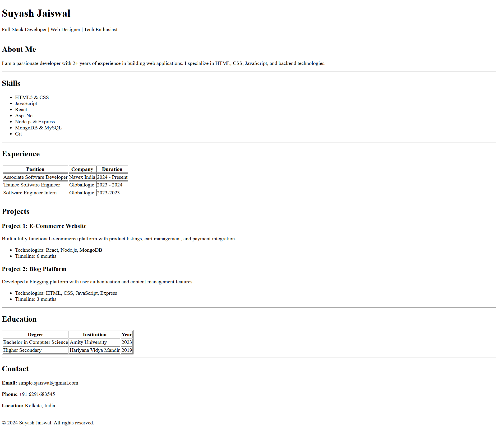

# Single-Page Resume Website (HTML)

This project is a clean, semantic, single-page resume website built using **pure HTML**.
It closely matches the provided reference layout and focuses on structure, readability,
and correct use of HTML elements.

---

## 🛠 Tech Stack
- HTML5 only
- No CSS or JavaScript (intentionally kept simple)

---

## 📂 Project Structure
resume-website/
│── index.html
│── README.md
│── image.png

---

## ▶️ Setup Instructions
1. Download or clone the repository
2. Open `index.html` in any modern web browser
3. No server or dependencies required

---

## 📌 Features
- Semantic HTML structure
- Clear section separation
- Tables for Experience and Education
- Lists for Skills and Project details
- Clean and readable layout

---

## 🖼 Screenshot

---

## ✅ Evaluation Checklist
- ✔ Proper HTML semantics
- ✔ Clean layout & spacing
- ✔ Readable typography
- ✔ Structured content
- ✔ Beginner-friendly code

---

## 📄 License
Free to use for learning and evaluation purposes.
